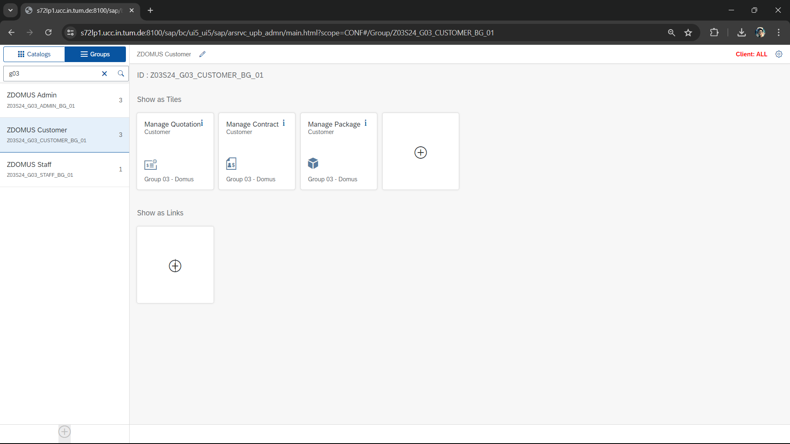

# SAP Interior Construction Quotation Applications

**Demonstration Video:** [https://youtu.be/dMY6Nq3g0ts](https://youtu.be/dMY6Nq3g0ts)

# 1. Requirements:

- **_Application name:_** Domus - SAP Interior Construction Quotation Applications.

- **_Purpose:_**

  - Domus helps customers create quotations through customizable packages (including products and services), supporting transparent negotiations between customers and staff, and providing a system of procedures until final contracts are created and signed. Especially, staff and customers could review the previous edited versions of quotations.

- **_Features:_**

  - **Staff:**

    - Manage packages
    - Manage quotations
    - Negotiate with customers
    - Manage contracts

  - **Customers:**

    - View packages
    - Customize packages
    - Request quotations
    - View quotations and quotation versions
    - Feedback quotations
    - Accept quotations
    - Cancel quotations
    - View contracts
    - Sign contracts

  - **Admin:**

    - View dashboard
    - Assign requested-quotations for staff

---

# 2. Demonstration:

- ## Scenario 01:

1. **Fiori Launchpad Home Page:**
2. **View package list (Staff):**
3. **Create new package (Staff):**
4. **Browse package list (Customer):**
5. **Customize one package (Customer):**
6. **View quotation list (Customer):**
7. **View quotation detail (Customer):**

- ## Scenario 02:

1. **Assign the quotation to one staff (Admin):**
2. **Update the assigned quotation(Staff):**
3. **View different quotation versions (Staff):**
4. **Accept the quotation (Customer):**
   
5. **Negotiation (Customer and Staff):**.png>)
6. **Make contract (Staff):**
   - View the accepted quotation: 
   - Write the contract description: 
     
   - Automatically send message to the customer: .png>)

- ## Scenario 03:

1. **Sign Contract (Customer):**
   - Contract **before** being signed: .png>)
   - Contract **after** being signed: 
2. **View dashboard (Admin):**

---

# 3. Database design:

- **Conceptual ERD:**
  
- **Logical ERD:**
  

---

# 4. Launchpad Designer:

- **_Technical Catalogs:_**

  - **Tiles:** 
  - **Target Mappings:** 

- **_Business Catalogs:_**

  - **Customer:** 
  - **Staff:** 
  - **Admin:** 

- **_Groups:_**

  - **Customer:** 
  - **Staff:** 
  - **Admin:** 

- **Result:**
  - **_Fiori Launchpad Home Page:_**

---

# 5. Tech Stack:

- DYNPRO, Table Control, Custom Control, Tabstrip, ALV, Message Class, RAP, Draft Scenario, Target Mapping using Launchpad Designer, Fiori Overview Page (Analytical Apps)
